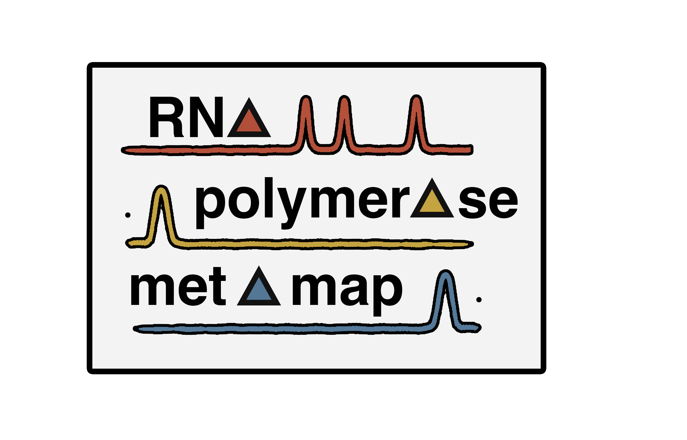
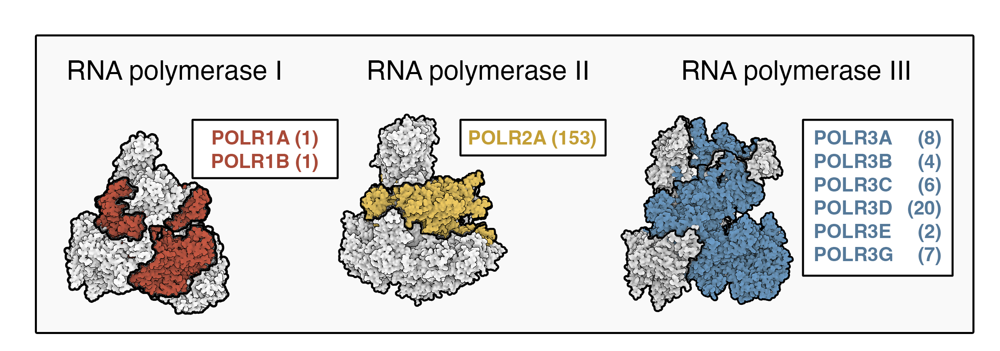

# Overview:

We applied a uniform, context-agnostic framework for scoring RNA polymerase (Pol) I, II, and III occupancies using > 200 ChIP-seq experiments performed in human tissues and cell lines, facilitating unbiased annotation of polymerase occupancy and overlap. This repository includes processed files and details related to our manuscript: KC et al., ...

# Data processing:

We retrieved available ChIP-seq data corresponding to complex-specific Pol I, II, and III subunits. Previous mapp- ing experiments for human Pol I are exceptionally limited, with only 2 datasets for binding of the large subunits, POLR1A and POLR1B. Pol II datasets are significantly more abundant, with 153 POLR2A ChIP-seq experiments available for the large subunit of Pol II. ChIP-seq experi- ments for Pol III, on the other hand, include a multitude of Pol III-specific subunits, including POLR3A, -B, -C, -D, -E, and -G

Pol II and III ChIP-seq data were compiled by unique cellular context for each individual subunit and uniformly scaled to the minimum number of subunit-specific sample reads. Summary profiles were then generated by combining all processed data and subsequently scaling to 100 million total reads, thereby producing a profile weighed equally by each biological context. Results for each Pol III subunit were further compiled into a median Pol III summary profile and re-scaled to 100 million reads. 

We next applied a peak calling framework for establish- ing a global polymerase-specific score at 50 bp resolution. Briefly, a poisson probability was calculated for every 50 bp bin by comparing the observed signal to a local expectation - lambda - defined as the maximum polymerase signal at 5 Kb, 10 Kb, or genome-wide - a stringent approach that accounts for local chromatin biases specific to each genomic window.

...

# 

# Data formats

# Underlying data

